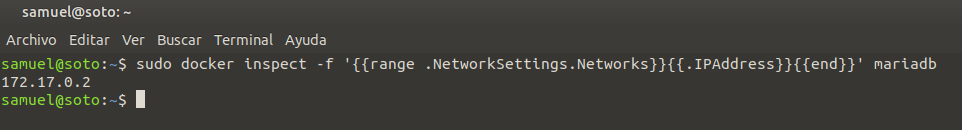
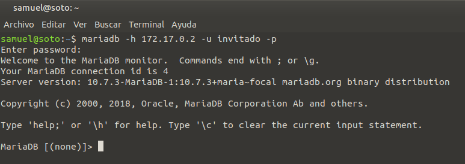
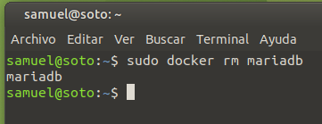

# Solución Ejercicio 1

[TOC]

## Servidor web

### Descargar imagen

Lo primero que debo hacer es descargar la imagen de Docker que me servirá para generar el contenedor. En este caso, descargo la versión indicada en el enunciado de la tarea: `php:7.4-apache`.

Para ello ejecuto el siguiente comando:

```shell
sudo docker pull php:7.4-apache
```


### Crear contenedor

A continuación debo crear el contenedor. En el enunciado de la tarea se especifica que debo darle el nombre "web" y habilitar el puerto "8000" de mi host para que pueda comunicarse a través del puerto "80" del contenedor. Además, debo sincronizar un directorio de mi host con el directorio "/www/html" del contenedor. Para hacerlo todo en uno, ejecuto el siguiente comando:

```shell
sudo docker run -d -p 8000:80 -it --name web -v "$(pwd)"/src:/var/www/html php:7.4-apache
```


### Insertar index.html

Actualmente, al acceder a la URL "http://localhost:8000" me da un "Forbidden" ya que, al no existir archivo alguno en el directorio raíz del servidor, no puedo acceder al mismo. Por ello creo un archivo "index.html" en mi directorio local "/src". De esta forma, se sincronizará con el directorio raíz del servidor Apache del contenedor y ya me permitirá ver la página.

El código que inserto en ese archivo es el siguiente:

```html
<h1>HOLA, SOY SAMUEL SOTO LOPEZ</h1>
```

Si ahora acceso al navegador a través de "http://localhost:8000" ya puedo ver mi index.html funcionando sin problema:


### Insertar mes.php

A continuación procedo a insertar un archivo "mes.php" que me muestre el mes de la fecha actual. Para ello utilizo el siguiente script PHP:

```php
<?php echo "Mes actual: " . date("F"); ?>
```

Se muestra así:


### Ver tamaño del contenedor

Una vez he agregado estos dos archivos, visualizo el tamaño actual de mi contenedor. Para ello utilizo el siguiente comando:

```shell
sudo docker ps -s
```


### Borrar contenedor

Antes de borrar el contenedor debo detenerlo, ya que Docker no permite eliminar contenedores que se encuentran en ejecución. Para detener el contenedor "web" utilizo el siguiente comando:

```shell
sudo docker stop web
```


Finalmente, utilizo este otro comando para eliminar el contenedor:

```shell
sudo docker rm web
```


Para confirmar que he borrado el contenedor correctamente, ejecuto el siguiente comando, que me lista todos los contenedores que tengo en el sistema:

```shell
sudo docker ps
```


Como se puede apreciar, ya no existe dicho contenedor.

## Servidor de base de datos

### Iniciar contenedor

Para iniciar un contenedor desde la imagen "mariadb", con nombre "bbdd", contraseña de root "root", con nombre de base de datos por defecto "prueba" y con creación de un nuevo usuario "invitado" que utilice la contraseña "invitado" ejecuto el siguiente comando:

```shell
$ sudo docker run --detach --name mariadb --env MARIADB_DATABASE=prueba --env MARIADB_USER=invitado --env MARIADB_PASSWORD=invitado --env MARIADB_ROOT_PASSWORD=root  mariadb:latest
```


El comando anterior contiene las distintas variables de entorno para establecer la configuración que se requiere en esta tarea:

- `MARIADB_DATABASE`: nombre de la base de datos por defecto.
- `MARIADB_USER`: nombre del usuario por defecto para la base de datos.
- `MARIADB_PASSWORD`: contraseña para el usuario por defecto.
- `MARIADB_ROOT_PASSWORD`: contraseña para el usuario "root".

### Conexión al servidor

Para conectarme al servidor de bases de datos desde el exterior del contenedor docker, necesito obtener primero la IP de dicho contenedor. Lo hago a través del siguiente comando:

```shell
sudo docker inspect -f '{{range .NetworkSettings.Networks}}{{.IPAddress}}{{end}}' mariadb
```



Tras averiguar la IP utilizo el siguiente comando para conectarme al servidor de bases de datos:

```shell
mariadb -h 172.17.0.2 -u invitado -p
```



Para poder realizar la conexión, previamente he instalado el cliente de MariaDB en mi host Linux. El nombre del paquete es `mariadb-client-core-10.3`.

A continuación muestro conexión completa al servidor de bases de datos, utilizando la sentencia `SHOW DATABASES;` en MariaDB.


### Intentando borrar imagen "mariadb" mientras el contenedor "mariadb" está creado

Para intentar eliminar la imagen "mariadb" (con una instancia de dicha imagen levantada) utilizo el siguiente comando:

```shell
sudo docker rm "mariadb"
```


Docker no me permite borrar esta imagen ya que existe un contenedor en ejecución que la utiliza. Me pide detener el contenedor antes de intentar eliminarla de nuevo.

## Otros

### Listar imágenes

Para listar las imágenes que tengo en mi registro local, ejecuto el siguiente comando:

```shell
sudo docker image ls
```


### Borrar contenedores

Si bien el contenedor del servidor web ya ha sido eliminado (a requerimiento del enunciado de la tarea) incluyo este apartado genérico que también se solicita. En este caso, borro únicamente el contenedor "mariadb", que es el único que queda (el proceso de borrado del contenedor "web" ya se ha detallado previamente en su apartado correspondiente).

Antes de borrar el contenedor "mariadb", primero debo detenerlo:

```shell
sudo docker stop mariadb
```


Posteriormente, ejecuto el siguiente comando para eliminarlo:

```shell
sudo docker rm mariadb
```



Contenedor borrado. Ejecuto el siguiente comando, que lista los contenedores existentes en mi sistema, para asegurarme:

```shell
sudo docker ps
```


Como puede apreciarse, no existen contenedores.