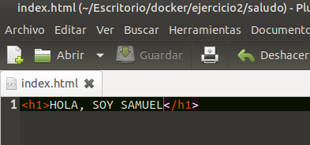
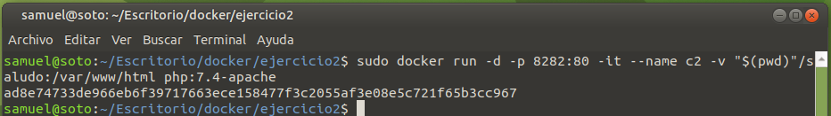
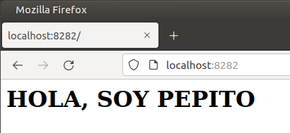

# Solución Ejercicio 2

[TOC]

## Bind mount para compartir datos

Para este ejercicio creo la carpeta, con su correspondiente archivo "index.html", que se solicitan desde el enunciado de la tarea. El contenido es el siguiente:



### Arrancar contenedores

Para arrancar el primer contenedor utilizando la imagen "php:7.4-apache" utilizo el siguiente comando:

```shell
sudo docker run -d -p 8181:80 -it --name c1 -v "$(pwd)"/saludo:/var/www/html php:7.4-apache
```


Para arrancar el segundo contenedor, desde la misma imagen, utilizo el siguiente comando:

```shell
sudo docker run -d -p 8282:80 -it --name c2 -v "$(pwd)"/saludo:/var/www/html php:7.4-apache
```



### Acceso a index.html

Utilizo la URL "http://localhost:8181/" para averiguar si puedo acceder sin problemas al archivo "index.html" desde el contenedor con nombre "c1":


Utilizo ahora el puerto "8282", "http://localhost:8282/" para averiguar si puedo acceder sin problemas al mismo archivo "index.html" desde el contenedor con nombre "c2":


### Modificando index.html

Modifico el archivo "index.html" desde mi host. Su contenido ahora es el siguiente:


### Accediendo nuevamente a index.html

Accedo al contenedor con nombre "c1" a través del puerto "8181":


Accedo al contenedor con nombre "c2" a través del puerto "8282":



Todo funciona correctamente.

### Borrando contenedores utilizados

Para borrar los contenedores, primero debo detenerlos. Para ello, ejecuto el siguiente comando:

```shell
sudo docker stop c1 c2
```


Finalmente, ejecuto el siguiente comando para borrarlos:

```shell
sudo docker rm c1 c2
```


Para verificar que efectivamente han sido eliminados, ejecuto como último comando:

```shell
sudo docker ps
```


Como se puede observar, ya no existe ningún contenedor.