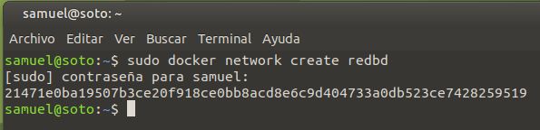
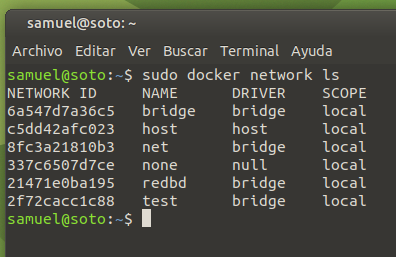
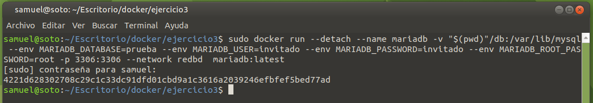
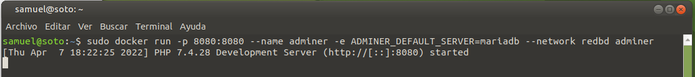

# Solución Ejercicio 3

[TOC]

## Despliegue de contenedores en red: Adminer y MariaDB

### Creando una red "bridge"

Para crear una red de tipo "bridge" utilizo el siguiente comando:

```shell
sudo docker network create redbd
```



Compruebo que se crea correctamente listando las redes existentes con este comando:



Ahí aparece la red "redbd" creada recientemente.

### Creando contenedores en red

Primero creo el contenedor para el servidor de bases de datos. Dicho contenedor levantará el servidor en el puerto 3306 (que mapearé al mismo puerto de mi host), utilizará volumen de datos persistente y se ejecutará en segundo plano. Lo asigno también a la red "redbd". Para ello, utilizo el siguiente comando:

```shell
sudo docker run --detach --name mariadb -v "$(pwd)"/db:/var/lib/mysql --env MARIADB_DATABASE=prueba --env MARIADB_USER=invitado --env MARIADB_PASSWORD=invitado --env MARIADB_ROOT_PASSWORD=root -p 3306:3306 --network redbd  mariadb:latest
```



Finalmente, creo el contenedor para Adminer (asignado a red "redbd"), utilizando para ello el siguiente comando:

```shell
sudo docker run -p 8080:8080 --name adminer -e ADMINER_DEFAULT_SERVER=mariadb --network redbd adminer
```


