# Solución Ejercicio 3

[TOC]

## Despliegue de contenedores en red: Adminer y MariaDB

### Creando una red "bridge"

Para crear una red de tipo "bridge" utilizo el siguiente comando:

```shell
sudo docker network create redbd
```


Compruebo que se crea correctamente listando las redes existentes con este comando:


Ahí aparece la red "redbd" creada recientemente.

### Creando contenedores en red

Primero creo el contenedor para el servidor de bases de datos. Dicho contenedor levantará el servidor en el puerto 3306 (que mapearé al mismo puerto de mi host), utilizará volumen de datos persistente y se ejecutará en segundo plano. Lo asigno también a la red "redbd". Para ello, utilizo el siguiente comando:

```shell
sudo docker run --detach --name mariadb -v "$(pwd)"/db:/var/lib/mysql --env MARIADB_DATABASE=prueba --env MARIADB_USER=invitado --env MARIADB_PASSWORD=invitado --env MARIADB_ROOT_PASSWORD=root -p 3306:3306 --network redbd  mariadb:latest
```


Finalmente, creo el contenedor para Adminer (asignado a red "redbd"), utilizando para ello el siguiente comando:

```shell
sudo docker run -p 8080:8080 --name adminer -e ADMINER_DEFAULT_SERVER=mariadb --network redbd adminer
```


### Accediendo a la base de datos desde el navegador

Para acceder a la base de datos "prueba" acudo al navegador, y accedo a la URL "http://localhost:8080", que se corresponde con el servidor del contenedor independiente a la base de datos (servidor web):

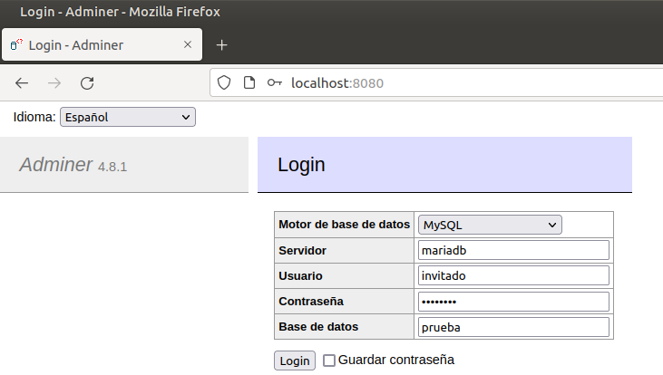

Al pulsar sobre "Login" veo lo siguiente:

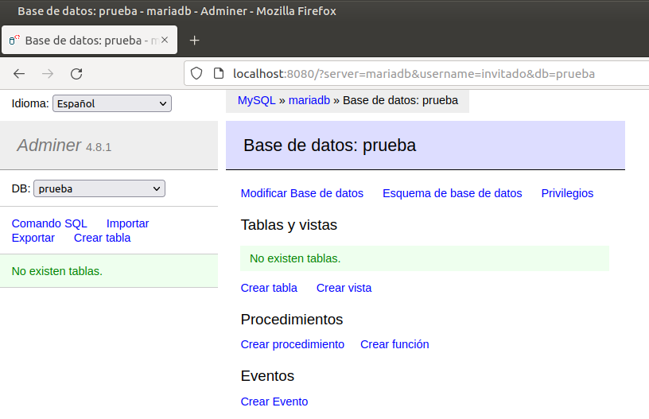

### Creando nueva base de datos

Para crear una nueva base de datos debo antes iniciar sesión como "root" sin especificar ninguna base de datos en el login:

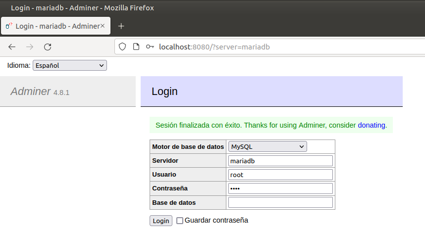

Pulso en "Login" y la interfaz me muestra un listado de las bases de datos existentes. Creo una nueva desde el enlace "Crear Base de datos":

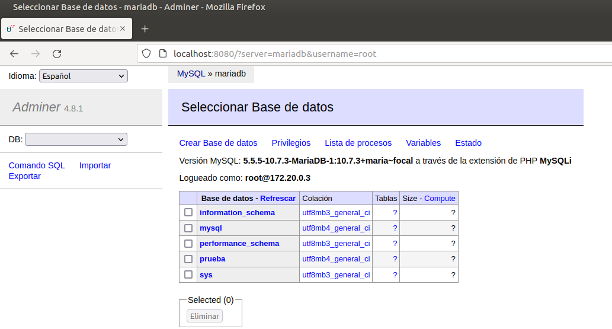

Al pulsar sobre dicho enlace veo la siguiente pantalla, en la que introduzco un nombre para la nueva base de datos y una codificación de caracteres:

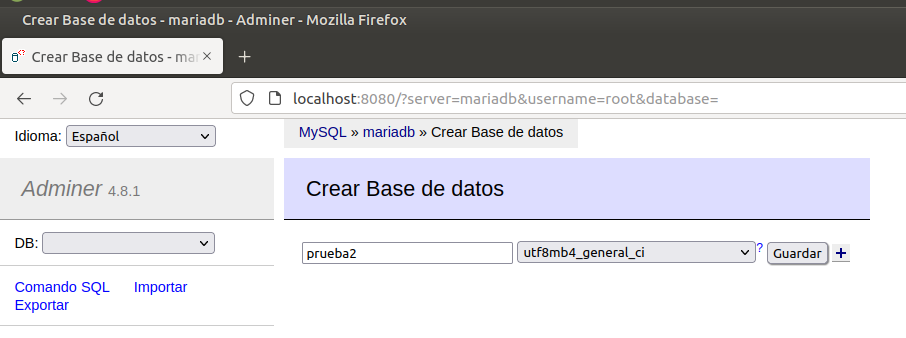

Pulso en "Guardar" y me muestra un mensaje en el que se indica que se ha creado la base de datos correctamente:

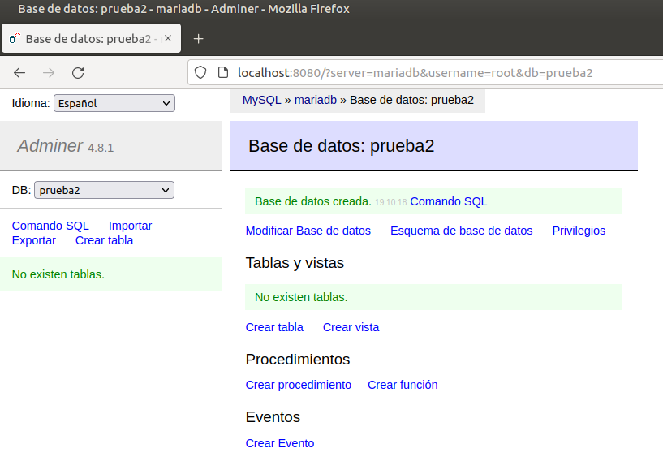

Para asegurarme vuelvo al listado de bases de datos, y efectivamente la veo creada junto al resto:

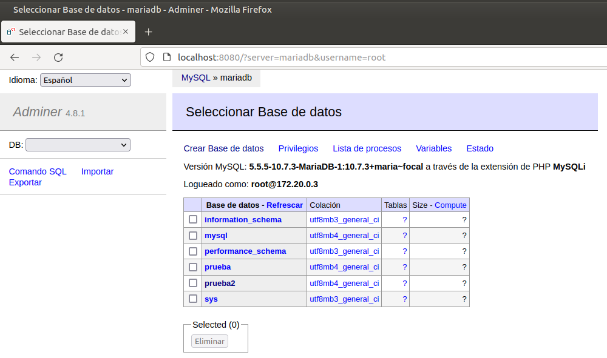

### Listando bases de datos con SQL

Para listar las bases de datos y comprobar que la nueva base de datos, "prueba2", se ha creado correctamente, debo entrar primero al contenedor "mariadb" en modo "bash". Para ello utilizo el siguiente comando:

```shell
sudo docker exec -it mariadb bash
```

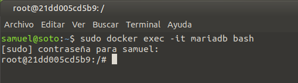

Una vez dentro del contenedor, introduzco el siguiente comando en la consola para acceder como usuario "root" a MariaDB:

```shell
mariadb -u root -p
```

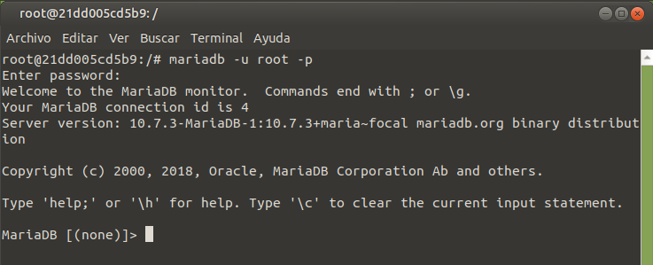

Me ha solicitado contraseña del usuario "root" y, tras introducirla, entro sin problema. Ahora ejecuto la siguiente sentencia SQL para listar todas las bases de datos existentes:

```sql
SHOW DATABASES;
```

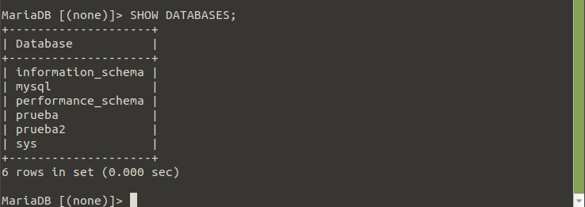

Se puede apreciar como la nueva base de datos creada, "prueba2", se encuentra en el listado.

### Listando contenedores en ejecución

Para listar los contenedores que se encuentran en ejecución en este momento, utilizo el siguiente comando:

```shell
sudo docker ps
```

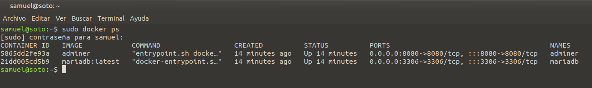

### Borrando contenedores, red y volúmenes utilizados

Para borrar los contenedores, primero debo pararlos. Para ello utilizo el siguiente comando:

```shell
sudo docker stop mariadb adminer
```

Después, para eliminarlos, utilizo este otro comando:

```shell
sudo docker rm mariadb adminer
```


Listo los contenedores, para ver si se han borrado correctamente:

```shell
sudo docker ps
```

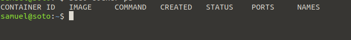

Efectivamente, contenedores borrados.

Para borrar la red "redbd" utilizo el siguiente comando:

```shell
sudo docker network rm redbd
```

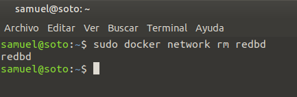

Listo las redes con este comando, para confirmar que la red "redbd" ya no existe:

```shell
sudo docker network ls
```

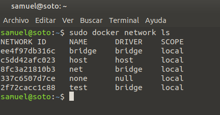

Para borrar el volumen creado para el contenedor "mariadb" utilizo el siguiente comando, con el que solicito borrar todos aquellos volúmenes que no se estén utilizando actualmente. Agrego `--force` para que no me pida confirmación: 

```shell
sudo docker volume prune --force
```

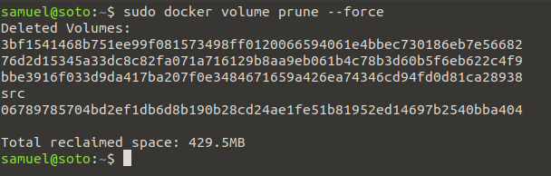

Tenía, como se puede apreciar, más volúmenes creados que no se estaban utilizando. Ahora listo, con el siguiente comando, los volúmenes existentes:

```shell
sudo docker volume ls
```

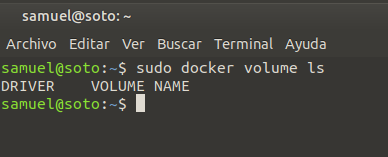

Ya no estaba utilizando ninguno, por lo que Docker los ha eliminado todos y actualmente no tengo volúmenes. Todo correcto.
