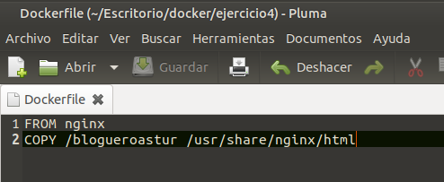
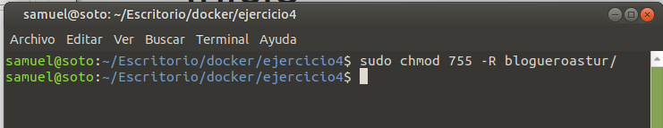
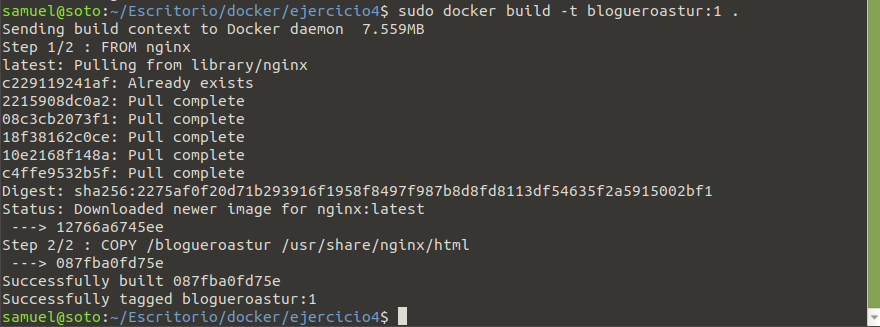
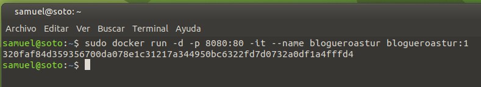
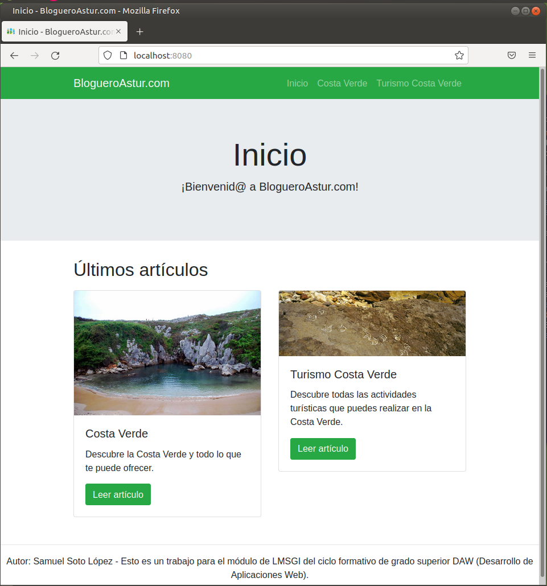

# Solución Ejercicio 4

[TOC]

## Crear una imagen con un servidor web que sirva un sitio web

Para crear una imagen personalizada basada en otra, primero debo crear un Dockerfile (archivo de texto del mismo nombre). Al mismo nivel, creo una carpeta llamada "blogueroastur" que almacenará los archivos necesarios del sitio web que copiaré en el directorio correspondiente del servidor web para que sea accesible a través del navegador. Voy a ello.

### Archivo Dockerfile

Creo un archivo Dockerfile con las siguientes instrucciones:

```dockerfile
FROM nginx
COPY /blogueroastur /usr/share/nginx/html
```



### Asignando permisos

Debo asignar permisos "755" para que, a la hora de crear la imagen y desplegar el contenedor, no me de problemas posteriormente para acceder a ciertos recursos a través del navegador. Para asignar permisos a esta carpeta utilizo el siguiente comando:

```shell
sudo chmod 755 -R blogueroastur/
```



### Construyendo la imagen

Me posiciono en el directorio raíz que incluye el Dockerfile y la carpeta "blogueroastur" con los archivos del website. Abro una terminal e introduzco el siguiente comando para crear una imagen de Docker con ese Dockerfile:

```shell
sudo docker build -t blogueroastur:1 .
```



### Creando una instancia (contenedor) desde imagen "blogueroastur:1"

Ahora, para poner en marcha una instancia (contenedor) de esta imagen, utilizo el siguiente comando:

```shell
sudo docker run -d -p 8080:80 -it --name blogueroastur blogueroastur:1
```



### Accediendo a la página web a través del navegador

Voy al navegador y entro en "http://localhost:8080" para comprobar si la página web se visualiza correctamente:


